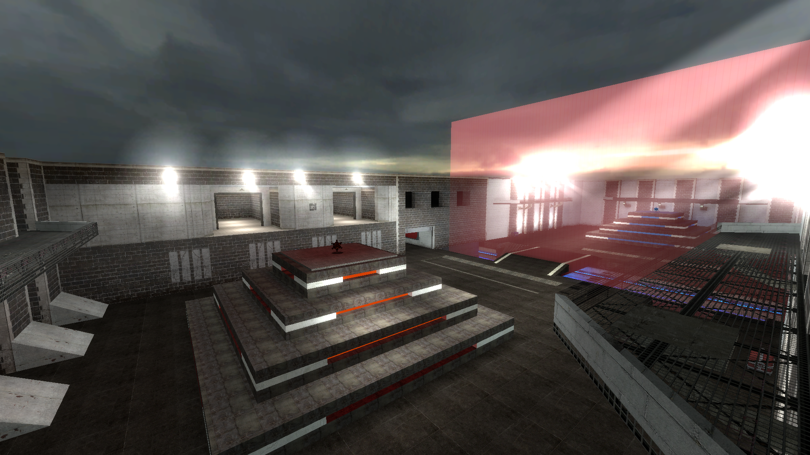

# LuminousForts Web

The website for the LuminousForts


<div align="center">
  
</div>

## Running locally

Requires [NodeJS 10.x](https://nodejs.org/en/) and higher

```
npm install -g yarn
yarn install
npm run develop
open http://localhost:8000
```

## Built

Using [Gatsby](https://www.gatsbyjs.org/).

## Tailwind

Uses [Tailwind CSS 0.74](https://v0.tailwindcss.com/docs/what-is-tailwind)